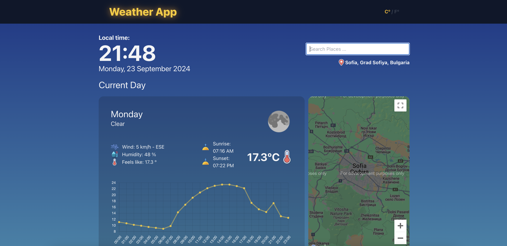

# Weather App ☀️🌧️

A simple, user-friendly weather application that provides detailed current and forecasted weather data. Easily switch between Celsius and Fahrenheit, explore an interactive map.

## Screenshot 📸


## Deployed 🌐 -> [Check out the deployed application](https://your-deployed-app-url.com)

## Features ✨

- 🔍 **Autocomplete Search**: Instantly find cities with an easy-to-use search function.
- 🗺️ **Map**: View the geographical location of the searched cities.
- 🌤️ **Current Day Weather Data**: Get the latest weather information for the current day.
- 🕑 **Current Day Data by Hour**: Hourly weather breakdown for precise details.
- 📅 **Forecast Day Weather**: See the weather forecast for the upcoming days.
- 🕒 **Forecast Day Data by Hour**: Get detailed hourly forecasts for future days.
- 🌡️ **Celsius / Fahrenheit**: Toggle between Celsius and Fahrenheit for temperature.
- 📈 **Temperature Chart**: Visual representation of temperature data.


## Installation & Setup ⚙️

1. Clone the repository:
    ```bash
    git clone https://github.com/your-username/weather-app.git
    ```
2. Install the required dependencies:
    ```bash
    npm install
    ```
3. Start the app:
    ```bash
    npm start
    ```

## Technologies Used 💻

- **Frontend**: React.js
- **API Integration**: OpenWeather API
- **Map Integration**: Google Maps API 
- **Charts**: Chart.js, React-Chartjs-2
- **Autocomplete**: React Places Autocomplete
- **Styling**: Tailwind CSS
- **Build Tool**: Vite
- **Language**: TypeScript

## Development Tools 🛠️

- ESLint: For code linting.
- PostCSS: For transforming CSS.
- Autoprefixer: For adding vendor prefixes to CSS.
- TypeScript: Ensures type safety in JavaScript.
  
## License 📄

This project is licensed under the MIT License.

---

